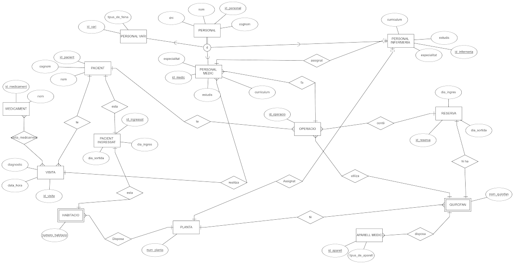

# <p align="center">  ESQUEMA RELACIONAL </p>
Justificació
------------
- Primer de tot nosaltres hem fet una superclasse per a personal, perquè considerem que és millor per tal d'evitar redundància. A més que nosaltres ho entenem així.


- Seguidament, nosaltres pensem que tant **HABITACIO** i **QUIROFAN** són entitats febles perquè depenen de l'entitat **PLANTA**

- Des de la taula d'**APARELL_MEDIC** mantenim un registre exhaustiu de tots els tipus d'aparells mèdics presents a l'hospital. Utilitzant l'identificador d'aquesta taula, a la taula **QUIROFAN_APARELL_MEDIC** podem gestionar l'assignació dels aparells a quiròfans específics. A més, tenim la capacitat d'especificar la quantitat de cada aparell disponible a cada **QUIROFAN**.

- Per nosaltres les relacions entre **PACIENT** i **OPERACIO**, és d'aquesta manera perquè un pacient pot tenir moltes operacions, en canvi, una operació només és per un pacient.

- Passa el mateix amb **PACIENT** i **VISITA**, ja que considerem que un pacient pot tenir moltes visites, i una vista és d'un  únic pacient.

- Per últim, en les operacions estan asociats **PERSONAL MEDIC** i els medics tenen asociats el **PERSONAL INFERMERIA**.



<br>

# <p align="center">  -MODEL ER </p>

<br>


<br>


# <p align="center"> CREACIO DE TAULES </p>
Taula Personal
--------------
```
CREATE TABLE PERSONAL ( 
id_personal SERIAL PRIMARY KEY UNIQUE, 
nom VARCHAR(25) NOT NULL, 
cognom VARCHAR(50) NOT NULL, 
dni CHAR(9) NOT NULL 
);
```
Taula Personal_Vari
-------------------
```
CREATE TABLE PERSONAL_VARI( 
id_vari SERIAL PRIMARY KEY UNIQUE, 
tipus_de_feina VARCHAR(25) NOT NULL, 
id_personal INT, 
CONSTRAINT personals_vari_fk FOREIGN KEY (id_personal) REFERENCES PERSONAL (id_personal) 
);
```
Taula Pacient
-------------
```
CREATE TABLE PACIENT ( 
id_pacient SERIAL PRIMARY KEY UNIQUE, 
nom VARCHAR(25) NOT NULL, 
cognom VARCHAR(50) NOT NULL
);
```
Taula Planta
------------
```
CREATE TABLE PLANTA (
num_plantes SERIAL PRIMARY KEY UNIQUE 
);
```
Taula Quirofan
--------------
```
CREATE TABLE QUIROFAN ( 
nom_quirofan CHAR(4) PRIMARY KEY UNIQUE, 
num_plantes INT, 
CONSTRAINT num_planta_fk FOREIGN KEY (num_plantes) REFERENCES PLANTA(num_plantes) 
);
```
Taula Medicament
----------------
```
CREATE TABLE MEDICAMENT ( 
id_medicament SERIAL PRIMARY KEY UNIQUE, 
nom VARCHAR(25) NOT NULL 
);
```
Taula Habitacio
---------------
```
CREATE TABLE HABITACIO ( 
num_habitacio SERIAL PRIMARY KEY UNIQUE,
num_plantes INT, 
CONSTRAINT planta_habitacio_fk FOREIGN KEY (num_plantes) REFERENCES PLANTA (num_plantes)
); 
```
Taula Reserva
-------------
```
CREATE TABLE RESERVA ( 
id_reserva SERIAL PRIMARY KEY UNIQUE,
dia_ingres DATE NOT NULL, 
dia_sortida DATE NOT NULL, 
nom_quirofan CHAR(4),
CONSTRAINT reserva_nom_quirofan_fk FOREIGN KEY (nom_quirofan) REFERENCES QUIROFAN (nom_quirofan)
); 
```
Taula Personal_Medic
--------------------
```
CREATE TABLE PERSONAL_MEDIC( 
id_medic SERIAL PRIMARY KEY UNIQUE,
especialitat VARCHAR(25) NOT NULL, 
curriculum VARCHAR(255), 
estudis VARCHAR(255), 
id_personal INT, 
CONSTRAINT personals_medic_fk FOREIGN KEY (id_personal) REFERENCES PERSONAL (id_personal)
); 
```
Taula Visita
------------
```
CREATE TABLE VISITA( 
id_visita SERIAL PRIMARY KEY UNIQUE, 
data_hora TIMESTAMP NOT NULL, 
diagnostic VARCHAR (255), 
id_pacient INT,
id_medic INT,
CONSTRAINT id_pacient_visita_fk FOREIGN KEY (id_pacient) REFERENCES PACIENT (id_pacient),
CONSTRAINT medic_visita_fk FOREIGN KEY (id_medic) REFERENCES PERSONAL_MEDIC (id_medic)
);
```
Taula Operacio
-------------
```
CREATE TABLE OPERACIO (
id_operacio SERIAL PRIMARY KEY UNIQUE,
id_pacient INT,
id_medic INT,
id_reserva INT,
CONSTRAINT pacient_operacio_fk FOREIGN KEY (id_pacient) REFERENCES PACIENT (id_pacient),
CONSTRAINT medic_operacio_fk FOREIGN KEY (id_medic) REFERENCES PERSONAL_MEDIC (id_medic),
CONSTRAINT reserva_operacio_fk FOREIGN KEY (id_reserva) REFERENCES RESERVA(id_reserva)
);
```
Taula Personal_Infermeria
-------------------------
```
CREATE TABLE PERSONAL_INFERMERIA( 
id_infermeria SERIAL PRIMARY KEY UNIQUE, 
estudis VARCHAR(255), 
especialitat VARCHAR(25) NOT NULL, 
curriculum VARCHAR(255),
id_personal INT, 
num_plantes INT,
id_medic INT,
CONSTRAINT personals_infermeria_fk FOREIGN KEY (id_personal) REFERENCES PERSONAL (id_personal), 
CONSTRAINT personal_infermeria_planta_fk FOREIGN KEY (num_plantes) REFERENCES PLANTA (num_plantes),
CONSTRAINT personal_infermeria_medic_fk FOREIGN KEY (id_medic) REFERENCES PERSONAL_MEDIC (id_medic)
);
```
Taula Aparell_Medic
-------------------
```
CREATE TABLE APARELL_MEDIC (
id_aparell_medic SERIAL PRIMARY KEY UNIQUE ,
tipus_de_aparell VARCHAR(25) NOT NULL
);
```
Taula Quirofan_Aparell_Medic
----------------------------
```
CREATE TABLE QUIROFAN_APARELL_MEDIC (
nom_quirofan CHAR(4),
id_aparell_medic INT,
quantitat INT,
CONSTRAINT aparell_medic_quirofan_fk FOREIGN KEY (nom_quirofan) REFERENCES QUIROFAN(nom_quirofan),
CONSTRAINT quirofan_aparell_fk FOREIGN KEY (id_aparell_medic) REFERENCES APARELL_MEDIC (id_aparell_medic)
);
```
Taula Visita_Medicament
-----------------------
```
CREATE TABLE VISITA_MEDICAMENT ( 
id_visita INT, 
id_medicament INT, 
CONSTRAINT id_visita_fk FOREIGN KEY (id_visita) REFERENCES VISITA(id_visita), 
CONSTRAINT id_medicament_fk FOREIGN KEY (id_medicament) REFERENCES MEDICAMENT(id_medicament) 
);
```
Taula PacienT_ingressat
-----------------------
```
CREATE TABLE PACIENT_INGRESSAT (
id_ingressat SERIAL PRIMARY KEY UNIQUE,
dia_ingres TIMESTAMP,
dia_sortida TIMESTAMP,
id_pacient INT,
num_habitacio INT,
CONSTRAINT pacient_pacient_ingressat_fk FOREIGN KEY (id_pacient) REFERENCES PACIENT (id_pacient),
CONSTRAINT num_habitacio_pacient_ingressat_fk FOREIGN KEY (num_habitacio) REFERENCES HABITACIO(num_habitacio)
);
```

# <p align="center"> Inserts provisionals </p>

<br>

Inserts ***Provisionals*** per posar a prova els ***rols*** i el ***codi*** de manteniment.

<br>


Insert Personal
---------------
```
INSERT INTO PERSONAL (id_personal, nom, cognom, dni) VALUES
    (1, 'Marc', 'Gómez', '12345678A'),
    (2, 'Laura', 'Martínez', '23456789B'),
    (3, 'Carlos', 'García', '34567890C'),
    (4, 'Ana', 'Sánchez', '45678901D'),
    (5, 'David', 'Rodríguez', '56789012E'),
    (6, 'Jaume', 'Sanchez', '96789012E'),
    (7, 'Daniel', 'Albo', '33789012E'),
    (8, 'Guillem', 'Garriga', '44789012E'),
    (9, 'Joan', 'Flores', '55789012E'),
    (10, 'Ricard', 'Romero', '56789012E');
```
Insert Pacient
--------------
```
INSERT INTO PACIENT (id_pacient, nom, cognom) VALUES
    (1, 'Pablo', 'González'),
    (2, 'Clara', 'Díaz'),
    (3, 'María', 'Ruiz'),
    (4, 'Roberto', 'Martín'),
    (5, 'Sara', 'Hernández');
```
Insert Planta
-------------
```
INSERT INTO PLANTA (num_plantes) VALUES
    (1),
    (2),
    (3),
    (4),
    (5);
```
Insert Habitacio
---------------
```
INSERT INTO HABITACIO (num_habitacio, num_plantes) VALUES
    (1, 1),
    (2, 2),
    (3, 3),
    (4, 4),
    (5, 5),
    (6,1),
    (7,2),
    (8,1);
```
Insert Visita
-------------
```
INSERT INTO VISITA (id_visita, data_hora, diagnostic) VALUES
    (1, '2024-04-18 10:00:00', 'Gripe'),
    (2, '2024-04-19 14:30:00', 'Control rutinario'),
    (3, '2024-04-20 09:15:00', 'Dolor abdominal'),
    (4, '2024-04-21 11:45:00', 'Fiebre'),
    (5, '2024-04-22 08:00:00', 'Consulta general');
```
Insert Quirofan
---------------
```
INSERT INTO QUIROFAN (nom_quirofan,num_plantes) VALUES
    ('Q101',1),
    ('Q102',2),
    ('Q103',3),
    ('Q104',4),
    ('Q105',5),
    ('Q106',1);
```
Insert Reserva
--------------
```
INSERT INTO RESERVA (id_reserva, dia_ingres, dia_sortida,num_habitacio,id_pacient) VALUES
    (1, '2024-04-18', '2024-04-20',1,1),
    (2, '2024-04-19', '2024-04-21',2,2),
    (3, '2024-04-20', '2024-04-22',3,3),
    (4, '2024-04-21', '2024-04-23',4,4),
    (5, '2024-04-22', '2024-04-24',5,5);
```
Insert Medicament
-----------------
```
INSERT INTO MEDICAMENT (id_medicament, nom) VALUES
    (1, 'Paracetamol'),
    (2, 'Ibuprofeno'),
    (3, 'Omeprazol'),
    (4, 'Amoxicilina'),
    (5, 'Loratadina');
```
Insert Operacio
---------------
```
INSERT INTO OPERACIO (id_operacio, id_reserva, nom_quirofan,id_pacient,id_medic) VALUES
    (1, 1, 'Q101',2,1),
    (2, 2, 'Q102',1,2),
    (3, 3, 'Q103',2,3),
    (4, 4, 'Q104',4,4),
    (5, 5, 'Q105',3,5);
```
Insert Personal_Medic
---------------------
```
INSERT INTO PERSONAL_MEDIC (id_medic, especialitat, curriculum, estudis, id_personal) VALUES
    (1, 'Cardiologia', 'Especialista en malalties del cor', 'Llicenciatura en Medicina', 1),
    (2, 'Pediatria', 'Especialista en atenció pediàtrica', 'Llicenciatura en Medicina', 2),
    (3, 'Traumatologia', 'Especialista en traumatismes i lesions', 'Llicenciatura en Medicina', 3),
    (4, 'Cirugia General', 'Especialista en cirurgia d`organs interns', 'Llicenciatura en Medicina', 4),
    (5, 'Geriatría', 'Especialista en geriatria i cures a persones grans', 'Llicenciatura en Medicina', 5);
```
Insert Personal_Infermeria
--------------------------
```
INSERT INTO PERSONAL_INFERMERIA (id_infermeria, estudis, especialitat, curriculum,id_personal,id_medic,num_plantes) VALUES 

    (1, 'Grau en Infermeria', 'Urgències', 'Experiència en hospital públic', 6,1, 1),
    (2, 'Diplomatura en Infermeria', 'Pediatria', 'Especialització en cures infantils',7, 2, 2),
    (3, 'Màster en Cures Intensives', 'Cures Intensives', 'Experiència en UCI',8, 3, 3),
    (4, 'Grau en Infermeria', 'Cirurgia', 'Especialització en cures pre i postoperatoris', 9,4, 4),
    (5, 'Diplomatura en Infermeria', 'Geriatría', 'Experiència en atenció a persones grans',10, 5, 5);
```
Insert Personal_Vari
--------------------
```
INSERT INTO PERSONAL_VARI (id_vari, tipus_de_feina, id_personal) VALUES
    (1, 'Neteja', 1),
    (2, 'Administració', 2),
    (3, 'Seguretat', 3),
    (4, 'Manteniment', 4),
    (5, 'Cafeteria', 5);
```
Insert Aparell_Medic
--------------------
```
INSERT INTO APARELL_MEDIC (id_aparell_medic, tipus_de_aparell) VALUES
    (1, 'Tensiòmetre'),
    (2, 'Electrocardiògraf'),
    (3, 'Respirador'),
    (4, 'Estatoscopi'),
    (5, 'Desfibril·lador');
```
Insert Visita_Medicament
------------------------
```
INSERT INTO VISITA_MEDICAMENT (id_visita, id_medicament) VALUES
    (1, 1),
    (2, 2),
    (3, 3),
    (4, 4),
    (5, 5);
```
Insert Quirofan_Aparell_Medic
-----------------------------
```
INSERT INTO QUIROFAN_APARELL_MEDIC (nom_quirofan, id_aparell_medic,quantitat) VALUES
	('Q101',1,2),
	('Q102',1,2),
	('Q103',1,2),
	('Q104',1,2),
	('Q101',2,5);
```

<br>

# Readme
#### [1.Primera Entrega Planificació del projecte ](https://github.com/Ruizzy98/Projecte-DAPM/tree/main/1.%20Primera%20Entrega%20Planificaci%C3%B3%20del%20projecte%20(BD%20%2B%20PRG))
#### [2. Segona Entrega Bloc de conectivitat i login](https://github.com/Ruizzy98/Projecte-DAPM/tree/main/2.%20Segona%20Entrega%20Bloc%20de%20conectivitat%20i%20login)
#### [3. Tercera Entrega Disseny ER-Model Relacional](https://github.com/Ruizzy98/Projecte-DAPM/tree/main/3.%20Tercera%20Entrega%20Disseny%20ER-Model%20Relacional)
#### [4. Quarta Entrega Esquema de seguretat](https://github.com/Ruizzy98/Projecte-DAPM/tree/main/4.%20Quarta%20Entrega%20Esquema%20de%20seguretat)
#### [5. Cinquena Entrega Esquema de seguretat](https://github.com/Ruizzy98/Projecte-DAPM/tree/main/5.%20Cinquena%20Entrega%20Bloc%20de%20manteniment)
#### [6. Sisena Entrega Esquema de seguretat](https://github.com/Ruizzy98/Projecte-DAPM/tree/main/6.%20Sisena%20Entrega%20Esquema%20d'alta%20disponibilitat)
#### [7. Setena Entrega Bloc de consultes](https://github.com/Ruizzy98/Projecte-DAPM/tree/main/7.%20Setena%20Entrega%20Bloc%20de%20consultes)
#### [8. Vuitena Entrega Dummy Data](https://github.com/Ruizzy98/Projecte-DAPM/tree/main/8.%20Vuitena%20Entrega%20Dummy%20Data)
#### [9. Novena entrega Exportació de Dades](https://github.com/Ruizzy98/Projecte-DAPM/tree/main/9.%20Novena%20entrega%20Exportaci%C3%B3%20de%20Dades)
