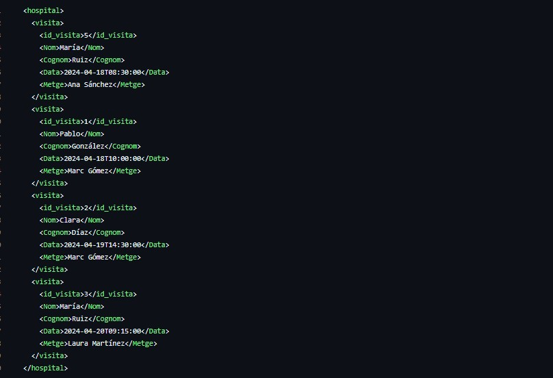

# 
 Documentacio XML i XSD  

Visites_pacients.xml
--------------------
Primer de tot nosaltres hem fet un XML per tal d'exportar les dades de les visites dins d'un rang de dates, per tenir un registres les dades que s'han realitzat. Per fer-ho hem creat el següent XML:

Visites_pacients.xsd
--------------------

Seguidament creem un XSD per definir l'estructura de l'arxiu XML de manera que, s'asseguri que cada visita tingui un identificador únic.
Per fer-ho hem creat el següent XSD:

