# 
  MANUAL D’USUARI 

 ----------------
Per començar, tenim el primer fitxer que utilitzarem durant tot el programa que és el main.py que el que fa és tenir en tot moment un menú que el que fa és seleccionar per números el menú i que funcioni un programa o funció amb el que hem seleccionat.
De primeres hem d'executar el menú i de primer ens surt aquest menú. 

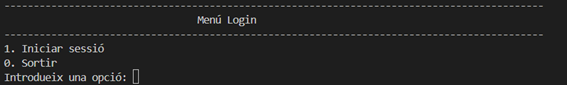

El que fa és iniciar sessió al programa amb codificació i depèn de l'usuari que iniciem sessió tindrà els seus rols i permisos.  
1	Iniciar sessió: el que fa aquesta funció és el següent.

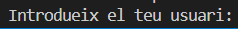

Et pregunta l'usuari per iniciar sessió.

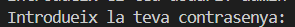

Pregunta després la contrasenya de l'usuari al qual volem accedir.
Si és tot correcte veurem el menú del programa si no és el correcte sortirà el següent missatge.

El programa el que farà és avisar que hem posat malament l'usuari o la contrasenya malament i ens donarà l'opció de torna a iniciar sessió.  
  0.	Sortir: el que fa la següent funció és sortir de l'aplicació aquesta funció sortirà en tot el menú, ja que ens interessa sortir en qualsevol moment del   
     programa.

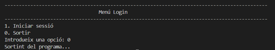

El missatge que sortirà és que confirma que surt del programa.
Confirmant que hem iniciat sessió amb l'usuari i contrasenya correcte ens sortirà aquest menú.

Aquest menú és totes les funcions i coses que pot mirar i executar l'usuari tenint en compte els seus permisos i rols que té cada usuari. Ara explicarem que fa tots els menús.  
1	Manteniments

 
Aquí podem obtenir, aconseguir i crear dades dels pacients, quiròfans, visites i tot el treball que guardem dins de la base de dades.  
1.1	Obtenir dependència infermeria:  
Aquí podem posar el número del ID de la infermera i ens dirà si depèn d'una planta o d'un metge. Aquí hi ha dos exemples:
En aquest cas depèn d'un metge. 

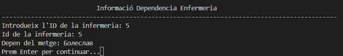

Aquí podem veure que depèn d'una planta.

1.2 Informació del quiròfan:
Aquí podem veure el dia, el pacient que s'operarà, en quin quiròfan i quins metges i infermeres estaran fent l'operació. Un exemple: 

1.3 Informació de les visites:
Aquí podrem accedir a la informació de les visites que hi ha en aquell dia, com per exemple hora, nom del metge i nom del pacient. Exemple:

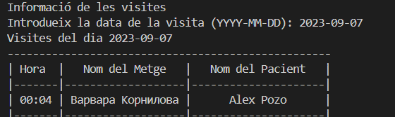

1.4 Informació reserves per habitació:
Dins podrem trobar la informació dels pacients que estan ingressats o que han estat ingressats i el dia de sortida. Exemple: 

1.5 Informació del pacient:
Dins d'aquí podem veure les visites del pacient, les vegades que ha estat ingressat, els cops que ha estat operat, el dia i l'hora de les visites, el nom del pacient, el diagnòstic que li ha donat el metge i els medicaments receptats. Exemple: 

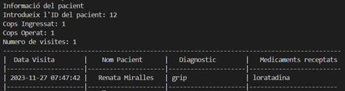

1.6 Informació equip de tots els quiròfans:
Aquí podem aconseguir tots els aparells que hi ha dins del quiròfan i la quantitat. Exemple:

 
1.7 Crear un nou usuari (metge, infermer/a o personal vari):
Aquí posem la informació del nou usuari com el DNI i la contrasenya i posem l'especialitat del nou usuari i ja tindríem un nou usuari. Exemple: 

1.8 Crear un nou pacient:
Aquí posem la informació del nou usuari com el nom i el cognom i ja crearíem el nou pacient. Exemple:

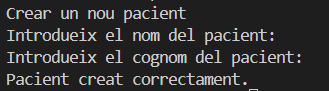

1.0 Tornar al menú principal:
Serveix per torna el menú per si ens hem equivocat o per si després volem sortir del programa.  

2: Consultes i informes:
Dins d'aquí podem aconseguir rankings i consultes o informes que hi ha dins del nostre hospital. Exemple: 

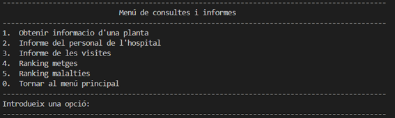

2.1. Obtenir informació d'una planta:
Aquí posem el número de la planta i ens diu la informació del número d'habitacions i quiròfans que hi ha i quan personal d'infermeria hi ha en aquesta planta. Exemple:   

2.2. Informe del personal de l'hospital:
Aquí ens diu els noms, DNI i el tipus de feina que té el personal de l'hospital. Exemple:

2.3. Informe de les visites:
Aquí posem la data de la visita i ens diu l'hora, el nom del metge, el nom del pacient, el diagnòstic que ha receptat el metge i el medicament. Exemple:

2.4. Ranking metges:
Aquí surten el ranking dels metges amb més visites de tot l'hospital. Exemple:

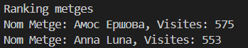

2.5. Ranking malalties:
Aquí és el mateix ranking que a dalt, però amb les malalties funciona igual el ranking. Exemple:

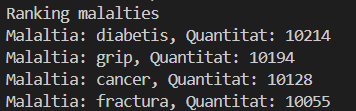

2.0. Tornar al menú principal:
Serveix per torna el menú per si ens hem equivocat o per si després volem sortir del programa.

 

3 Exportació de dades:  
Aquí el que fem és posar dues dades una data d'inici i una data de fi i ens agafa tota la informació de les visites durant el rang de dies que hem posat i posem la ubicació on volem guarda el fitxer. Exemple:

 

4 Dummy Data:  
Aquí podem crear dades "Fake" dins la base de dades per fer proves i per comprovar errors o manteniment.

4.1. Generar les dades:
Aquí és on generem les dades "Fake" per fer les proves. Exemple: 

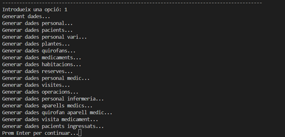

4.2. Eliminar dades:
Aquí podem esborrar totes les dades creades anteriorment per si ja no volem fer més proves o perquè no molestin. Exemple: 

4.0. Tornar al menú principal:
Serveix per torna el menú per si ens em equivocat o per si després volem sortir del programa. 
0.	Sortir: Serveix per canviar d’usuari o sortir de l’aplicació.

# Readme

#### [1.  Primera Entrega Planificació del projecte](https://github.com/Ruizzy98/Projecte-DAPM/tree/main/1.%20Primera%20Entrega%20Planificaci%C3%B3%20del%20projecte)
#### [2.  Segona Entrega Bloc de conectivitat i login](https://github.com/Ruizzy98/Projecte-DAPM/tree/main/2.%20Segona%20Entrega%20Bloc%20de%20conectivitat%20i%20login)
#### [3.  Tercera Entrega Disseny ER-Model Relacional](https://github.com/Ruizzy98/Projecte-DAPM/tree/main/3.%20Tercera%20Entrega%20Disseny%20ER-Model%20Relacional)
#### [4.  Quarta Entrega Esquema de seguretat](https://github.com/Ruizzy98/Projecte-DAPM/tree/main/4.%20Quarta%20Entrega%20Esquema%20de%20seguretat)
#### [5.  Cinquena Entrega Esquema de seguretat](https://github.com/Ruizzy98/Projecte-DAPM/tree/main/5.%20Cinquena%20Entrega%20Bloc%20de%20manteniment)
#### [6.  Sisena Entrega Esquema de seguretat](https://github.com/Ruizzy98/Projecte-DAPM/tree/main/6.%20Sisena%20Entrega%20Esquema%20d'alta%20disponibilitat)
#### [7.  Setena Entrega Bloc de consultes](https://github.com/Ruizzy98/Projecte-DAPM/tree/main/7.%20Setena%20Entrega%20Bloc%20de%20consultes)
#### [8.  Vuitena Entrega Dummy Data](https://github.com/Ruizzy98/Projecte-DAPM/tree/main/8.%20Vuitena%20Entrega%20Dummy%20Data)
#### [9.  Novena entrega Exportació de Dades](https://github.com/Ruizzy98/Projecte-DAPM/tree/main/9.%20Novena%20entrega%20Exportaci%C3%B3%20de%20Dades)
#### [10. Desena entrega Document final i maual de usuari](https://github.com/Ruizzy98/Projecte-DAPM/tree/main/10%20Desena%20entrega%20Document%20final%20i%20manual%20d'usuari)
