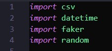

# <p align="center">  Dummy Data  </p>
Faker
-------------
En aquest cas hem utilitzat el faker

Faker és una eina en Python que permet generar dades fictícies. Amb aquesta llibreria, pots crear qualsevol dada fictícia.
<br>
Això és útil quan necessites omplir una base de dades amb dades de prova o realitzar proves en el teu codi sense utilitzar informació real, i també per protegir la privadesa de les persones en el procés de desenvolupament de software. 


Com l'hem utilitzat?
-----
Per començar, vam fer el pip install al cmd:


Seguidament, en utilitzar un arxiu Python cal posar aquests imports:




Creació d'Índex
---------------
Índex per a la taula RESERVA en la columna nom_quirofan:
```
CREATE INDEX index_reserva_nom_quirofan ON RESERVA (nom_quirofan);
```

Índex per a la taula VISITA en la columna id_pacient:
```
CREATE INDEX index_visita_id_pacient ON VISITA (id_pacient); <br>
```

Índex per a la taula VISITA en la columna id_medic:
```
CREATE INDEX index_visita_id_medic ON VISITA (id_medic); <br>
```

Índex per a la taula OPERACIO en la columna id_pacient:
```
CREATE INDEX index_operacio_id_pacient ON OPERACIO (id_pacient); <br>
```

Índex per a la taula OPERACIO en la columna id_medic:
```
CREATE INDEX index_operacio_id_medic ON OPERACIO (id_medic); <br>
```

Índex per a la taula PACIENT_INGRESSAT en la columna num_habitacio:
```
CREATE INDEX index_pacient_ingressat_num_habitacio ON PACIENT_INGRESSAT (num_habitacio);
```

# Readme
#### [1.Primera Entrega Planificació del projecte ](https://github.com/Ruizzy98/Projecte-DAPM/tree/main/1.%20Primera%20Entrega%20Planificaci%C3%B3%20del%20projecte%20(BD%20%2B%20PRG))
#### [2. Segona Entrega Bloc de conectivitat i login](https://github.com/Ruizzy98/Projecte-DAPM/tree/main/2.%20Segona%20Entrega%20Bloc%20de%20conectivitat%20i%20login)
#### [3. Tercera Entrega Disseny ER-Model Relacional](https://github.com/Ruizzy98/Projecte-DAPM/tree/main/3.%20Tercera%20Entrega%20Disseny%20ER-Model%20Relacional)
#### [4. Quarta Entrega Esquema de seguretat](https://github.com/Ruizzy98/Projecte-DAPM/tree/main/4.%20Quarta%20Entrega%20Esquema%20de%20seguretat)
#### [5. Cinquena Entrega Esquema de seguretat](https://github.com/Ruizzy98/Projecte-DAPM/tree/main/5.%20Cinquena%20Entrega%20Bloc%20de%20manteniment)
#### [6. Sisena Entrega Esquema de seguretat](https://github.com/Ruizzy98/Projecte-DAPM/tree/main/6.%20Sisena%20Entrega%20Esquema%20d'alta%20disponibilitat)
#### [7. Setena Entrega Bloc de consultes](https://github.com/Ruizzy98/Projecte-DAPM/tree/main/7.%20Setena%20Entrega%20Bloc%20de%20consultes)
#### [8. Vuitena Entrega Dummy Data](https://github.com/Ruizzy98/Projecte-DAPM/tree/main/8.%20Vuitena%20Entrega%20Dummy%20Data)
#### [9. Novena entrega Exportació de Dades](https://github.com/Ruizzy98/Projecte-DAPM/tree/main/9.%20Novena%20entrega%20Exportaci%C3%B3%20de%20Dades)
